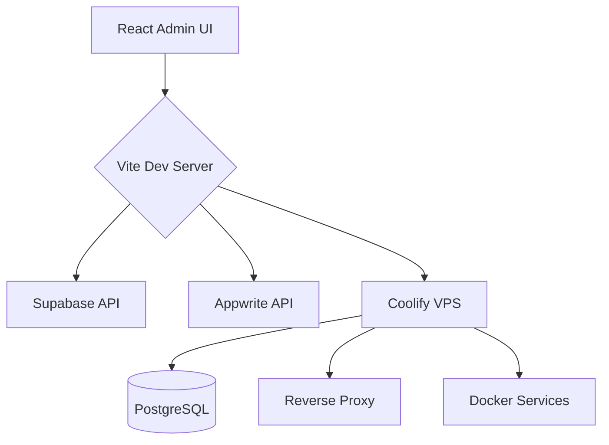

# supabase-appwrite

## Metadata

| Field | Value |
|-------|-------|
| Name | supabase-appwrite |
| Description | Guidelines for working on the Vite + React control panel that manages a self-hosted VPS backend stack via Coolify, with experiments in Supabase and Appwrite. |
| Version | 0.1.0 |
| Author | rahmanashis01 |

## When to Use

Use this skill whenever the user asks about:

- Adding features to the React dashboard/app
- Configuring Vite, ESLint, or React tooling
- Integrating with Supabase or Appwrite
- Working with Coolify, VPS hosting, or Docker Compose files
- Managing backend service health checks, status pages, or admin panels
- Creating diagrams, project docs, or deployment notes

## Project Conventions

- **Frontend framework**: React 18+ with Vite
- **Styling**: plain CSS (`src/index.css`) unless otherwise specified
- **Component location**: `src/components/`
- **Entry point**: `src/main.jsx` mounting into `index.html`
- **Backend management**: through a self-hosted Coolify instance on a VPS
- **Experiments**: Supabase and Appwrite as backend-as-a-service alternatives
- **Environment**: keep secrets in `.env` / `.env.local` (ignored by `.gitignore`)
- **Commands**: use `npm` and `npx` for package management

## Common Commands

```bash
# Install dependencies
npm install

# Start dev server
npm run dev

# Build for production
npm run build

# Preview production build
npm run preview

# Lint
npm run lint
```

## Architecture



## File Layout

```
.claude/
  skills/supabase-appwrite/    # This skill
    SKILL.md                    # Required metadata + instructions
    scripts/                    # Optional: helper scripts
    references/                 # Optional: docs and cheatsheets
    assets/                     # Optional: templates, icons, etc.
docs/
  diagrams/                     # Mermaid diagrams for architecture
public/
src/
  components/                   # React components
  App.jsx                       # Root component
  index.css                     # Global styles
  main.jsx                      # Entry point
index.html
vite.config.js
eslint.config.js
package.json
```

## Workflow Notes

1. Check `git status` before making changes.
2. Update `CLAUDE.md` or this skill if project conventions change.
3. Add Mermaid diagrams to `docs/diagrams/` for new architecture.
4. Keep the React dashboard focused on service status, health, and basic control actions.
5. Avoid hardcoding credentials; use environment variables only.

## References

- [Vite docs](https://vitejs.dev/guide/)
- [React docs](https://react.dev/)
- [Supabase JS client](https://supabase.com/docs/reference/javascript/introduction)
- [Appwrite docs](https://appwrite.io/docs)
- [Coolify docs](https://coolify.io/docs/)

---
*Skill file for the supabase-appwrite project.*
