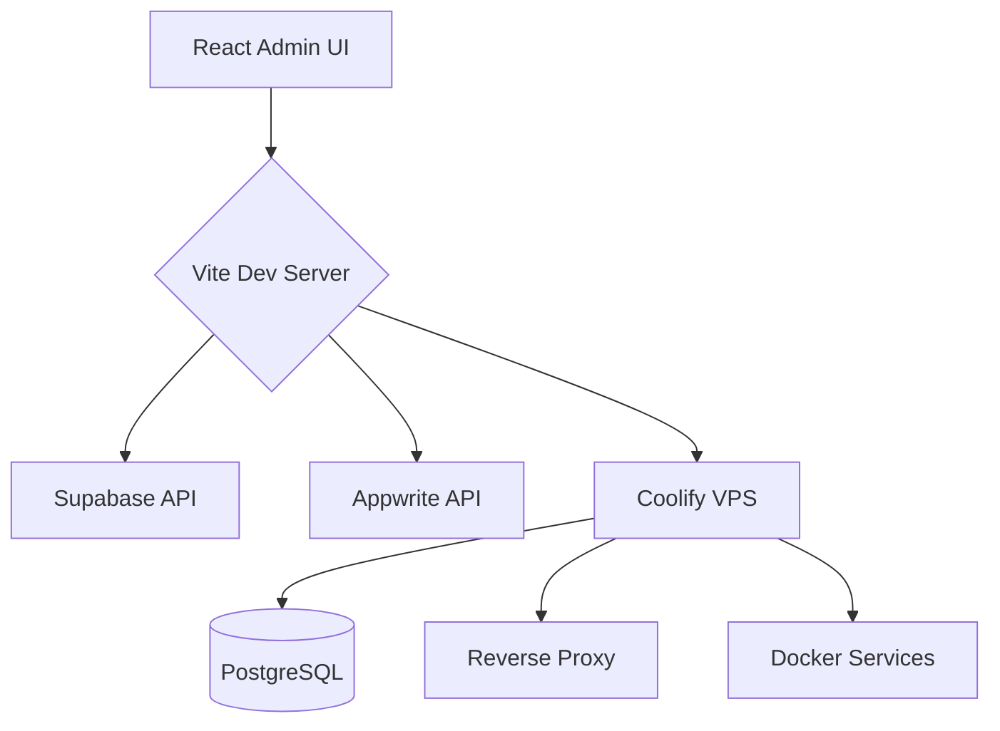

# VPS Backend Hosting Lab with Coolify + React Control Panel

This is my **personal private playground repository** where I experiment with hosting backend applications on a VPS using **Coolify** and managing services through a **React application**.

> ⚠️ This repo is for learning, trying ideas, and exploration.  
> Setup may change frequently and may include unfinished or temporary code.

---

## 🚀 Project Goal

Build and manage a self-hosted backend environment that includes:

- VPS-hosted applications
- OS-level/server panel management via **Coolify**
- A **React dashboard/app** for monitoring and controlling services
- Integration and experiments with:
  - **Supabase**
  - **Appwrite** (assuming "apperite" = Appwrite)
  - **Reverse Proxy** (assuming "prevese porxy" = reverse proxy)
  - **PostgreSQL**
  - and other backend tools/services

---

## 🧪 What I’m Exploring

- Deploying containerized apps on a VPS
- Managing apps/services with Coolify
- Connecting frontend (React + Vite) with backend service health/status
- Authentication and access control for internal tooling
- Reverse proxy routing (domains/subdomains, SSL, traffic handling)
- Database setup and backups (PostgreSQL)
- Self-hosted alternatives for BaaS and internal platforms

---

## 🧱 Planned/Used Stack

- **Frontend:** React + Vite
- **Styling:** Plain CSS (`src/index.css`)
- **UI Components:** Custom components in `src/components/`
- **Linting:** ESLint
- **Server/VPS:** Linux VPS (self-hosted)
- **Control Panel / PaaS Layer:** Coolify
- **Backend & Infra Services:**
  - Supabase
  - Appwrite
  - PostgreSQL
  - Reverse Proxy (Nginx/Traefik/Caddy depending on setup)
- **Containerization:** Docker / Docker Compose (as needed)

---

## 📁 Repository Structure

```
supabase-appwrite/
├── .claude/                  # Claude Code configuration
│   ├── commands.json         # Custom slash commands
│   ├── settings.json         # Project settings + hooks
│   ├── settings.local.json   # Local-only settings
│   └── skills/               # Project-specific Claude skill
│       └── supabase-appwrite/
│           ├── SKILL.md
│           ├── scripts/
│           ├── references/
│           └── assets/
├── docs/
│   └── diagrams/
│       └── architecture.mmd  # Mermaid architecture diagram
├── public/                   # Static assets
├── src/                      # React source code
│   ├── components/           # Reusable React components
│   ├── App.jsx               # Root component
│   ├── index.css             # Global styles
│   └── main.jsx              # Entry point
├── .gitignore
├── CLAUDE.md                 # Claude Code project context
├── eslint.config.js
├── index.html
├── package.json
├── package-lock.json
├── README.md
└── vite.config.js
```

---

## 🛠️ Common Commands

```bash
# Install dependencies
npm install

# Start the Vite dev server
npm run dev

# Build for production
npm run build

# Preview the production build
npm run preview

# Lint the project
npm run lint
```

---

## 🏗️ Architecture

See [`docs/diagrams/architecture.mmd`](docs/diagrams/architecture.mmd) for a Mermaid diagram of the current system layout.



---

## 🤖 Claude Code Setup

This project is configured for [Claude Code](https://code.claude.com/):

- **Custom commands** in `.claude/commands.json`
- **Permission allowlist** in `.claude/settings.json`
- **Project context** in `CLAUDE.md`
- **Project skill** in `.claude/skills/supabase-appwrite/SKILL.md`

Use `/status`, `/install`, or `/diagram` to run the custom commands.

---

## 📋 Repository Nature

This is a **private personal lab** repo:
- Not production-ready
- No guaranteed stability
- Frequent refactors
- Experimental infrastructure and service integrations

---

## 🔐 Security Notes (Personal Checklist)

- Use strong SSH keys (disable password login if possible)
- Restrict open ports with firewall
- Keep Coolify and VPS packages updated
- Store secrets in environment variables (never hardcode)
- Enable automated backups for PostgreSQL and config files
- Use HTTPS/TLS for exposed services

---

## 🗺️ Roadmap (Draft)

- [x] Initialize Vite + React frontend skeleton
- [x] Set up Claude Code project configuration and skill
- [ ] Install frontend dependencies
- [ ] Create basic React dashboard layout
- [ ] Add service health/status components
- [ ] Initial VPS hardening and base setup
- [ ] Install and configure Coolify
- [ ] Deploy first backend service
- [ ] Add reverse proxy + domain routing
- [ ] Connect service metrics and health checks
- [ ] Add Supabase/Appwrite experiments
- [ ] Add automated backup/restore workflow
- [ ] Improve observability (logs, uptime, alerts)

---

## 📝 Notes

This project is intentionally flexible.  
I may break things, rebuild architecture, and compare different self-hosting approaches over time.

---

## 📌 License

Private repository — personal use and experimentation.
